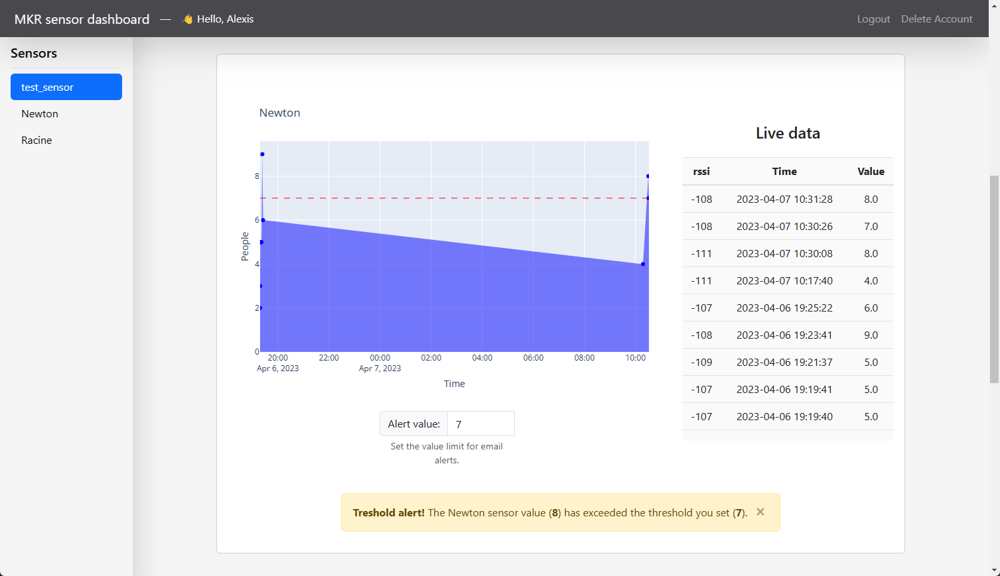

# Loraboard
Open-source simple dashboard for MKR1310 sensor. The MKR will connect to a [LoRa](https://www.thethingsnetwork.org/docs/lorawan/what-is-lorawan/) gateway, then send data to [TheThingsNetwork](https://www.thethingsnetwork.org/). The application will retrieve the live data from TTN, store it into a databse and print it on the live dashboard.

<br />

> 🤖 Built for an IoT class from [UQAC](https://www.uqac.ca/)

- ✅ `Database`, `Authentication`: `SQLite`
- ✅ `HTML`: `Bootstrap`
- ✅ `Mail`: [`Google API`](https://developers.google.com/identity/protocols/oauth2/scopes?hl=fr#gmail)
- ✅ `MKR Firmware`: `Arduino`
- 🚀 `Deployment` 
  - TODO [Video title](youtube_link) (`video presentation`)

<br />



<br />

## ✨ Start the app

> 👉 **Step 1** - Download the code 
```bash
$ git clone https://github.com/tartopommes/Loraboard.git
$ cd Loraboard
```
<br />

> 👉 **Step 2** - Install the librairies (if you wish the use a virtual environment, see [Run with python virtual environment](#✨-run-with-python-virtual-environment))
```pwsh
python -m pip pip install -r requirements.txt
```
<br />

> 👉 **Step 3** - Make sure `super_secret.py` exists and is correct
```py
Username = "you-ttn-project-name"
Username_ssh = f"{Username}@ttn"
Password = "XXXXX.XXXXXXXXXXXXXXXXXXXXXXXXXXXXXXXXXXXXXXX.XXXXXXXXXXXXXXXXXXXXXXXXXXXXXXXXXXXXXXXXXXXXXXXXXXXX" # 99 characters in full maj

public_address_url = "nam1.cloud.thethings.network"
public_address_port = 1883
public_address = f"{public_address_url}:{public_address_port}"
```
<br />

> 👉 **Step 4** - Setup the alert sender mail address 

Go to `Loraboard/database/gestion.py` and edit the variable `SENDER`
```py
# MAILS
SENDER = 'your-email@gmail.com' # set your email address here, must belong to gmail.com
```

Then the application will need to create a `token.json` file. Once you strated the application, you will automatically be redirected to a google connextion page to `select your google account`. Then you will have a danger alert, because the Google application we are using hasn't been verified by Google yet. However it's competly fine, the Google application is only used for this project to send email alert, you can clic on `Advanced settings` and then clic on `Access` and finally `Continue`. You are free not to accept, in this case you purposely reject email alert notifications.

<br />

> 👉 **Step 5** - Start the App with `python`
```pwsh
python main.py
```
<br />

> 👉 **Step 6** - Visit the dashboard `python`

Go to the default url: [http://localhost:5000/](http://localhost:5000/)

<br />

## ✨ Run with python virtual environment 
You may want to use a virtual environnement for the application, here's how to proceed

> 👉 **Step 1** - install virtualenv with python 

```pwsh
python -m pip install --upgrade pip
python -m pip install --user virtualenv
python -m venv venv
```

<br />

> 👉 **Step 2** - activate the virtual environment 
- `Unix`, `MacOS`
```bash
source venv/bin/activate
```

- `Windows`
```pwsh
.\venv\Scripts\activate
```

<br />

> 👉 **Step 3** - Install the librairies on your virtual environnement 

```pwsh
python -m pip install --upgrade pip
pip install -r requirements.txt
```

<br />

## ✨ Reset the database
When you start the application for the first time, a database file is created: `database/users.db`. Delete this file after shutting down your application and it will be recreated (with default values) the next time you start it.