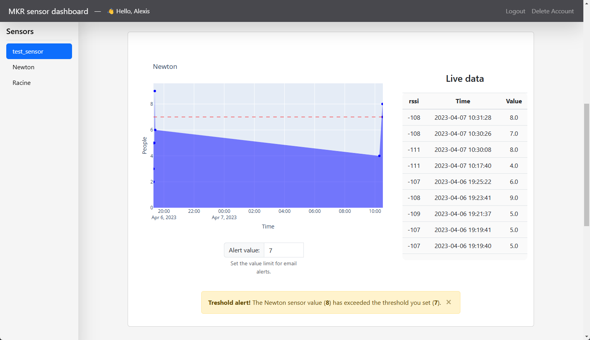

Loraboard
=========

Open-source simple dashboard for MKR1310 sensor. The MKR will connect to a `LoRa <https://www.thethingsnetwork.org/docs/lorawan/what-is-lorawan/>`_ gateway, then send data to `TheThingsNetwork <https://www.thethingsnetwork.org/>`_. The application will retrieve the live data from TTN, store it into a database and print it on the live dashboard.

Built for an IoT class from `UQAC <https://www.uqac.ca/>`_

- Database, Authentication: SQLite
- HTML: Bootstrap
- Mail: `Google API <https://developers.google.com/identity/protocols/oauth2/scopes?hl=fr#gmail>`_
- MKR Firmware: Arduino
- Deployment
  - TODO `Video title <youtube_link>`_ (`video presentation`)

Start the app
-------------

Step 1 - Download the code

.. code-block:: bash

    $ git clone https://github.com/tartopommes/Loraboard.git
    $ cd Loraboard

Step 2 - Install the libraries (if you wish the use a virtual environment, see :ref:`run-with-python-virtual-environment`)

.. code-block:: pwsh

    python -m pip pip install -r requirements.txt

Step 3 - Make sure ``super_secret.py`` exists and is correct

.. code-block:: python

    Username = "you-ttn-project-name"
    Username_ssh = f"{Username}@ttn"
    Password = "XXXXX.XXXXXXXXXXXXXXXXXXXXXXXXXXXXXXXXXXXXXXX.XXXXXXXXXXXXXXXXXXXXXXXXXXXXXXXXXXXXXXXXXXXXXXXXXXXX" # 99 characters in full maj

    public_address_url = "nam1.cloud.thethings.network"
    public_address_port = 1883
    public_address = f"{public_address_url}:{public_address_port}"

Step 4 - Setup the alert sender mail address

Go to ``Loraboard/database/gestion.py`` and edit the variable ``SENDER``

.. code-block:: python

    # MAILS
    SENDER = 'your-email@gmail.com' # set your email address here, must belong to gmail.com

Then the application will need to create a ``token.json`` file. Once you started the application, you will automatically be redirected to a Google connection page to ``select your Google account``. Then you will have a danger alert, because the Google application we are using hasn't been verified by Google yet. However it's completely fine, the Google application is only used for this project to send email alert, you can click on ``Advanced settings`` and then click on ``Access`` and finally ``Continue``. You are free not to accept, in this case you purposely reject email alert notifications.

Step 5 - Start the App with ``python``

.. code-block:: pwsh

    python main.py

Step 6 - Visit the dashboard `python`

Go to the default URL: `http://localhost:5000/`

.. _run-with-python-virtual-environment:

Run with python virtual environment
-----------------------------------

You may want to use a virtual environment for the application, here's how to proceed

Step 1 - install virtualenv with python

.. code-block:: pwsh

    python -m pip install --upgrade pip
    python -m pip install --user virtualenv
    python -m venv venv

Step 2 - activate the virtual environment

- Unix, MacOS

.. code-block:: bash

    source venv/bin/activate

- Windows

.. code-block:: pwsh

    .\venv\Scripts\activate

Step 3 - install the libraries on the virtual environment

.. code-block:: pwsh

    python -p pip install --upgrade pip
    python -m pip install -r requirements.txt

Reset the database
------------------

When you start the application for the first time, a database file is created: `database/users.db`. Delete this file after shutting down your application and it will be recreated (with default values) the next time you start it.